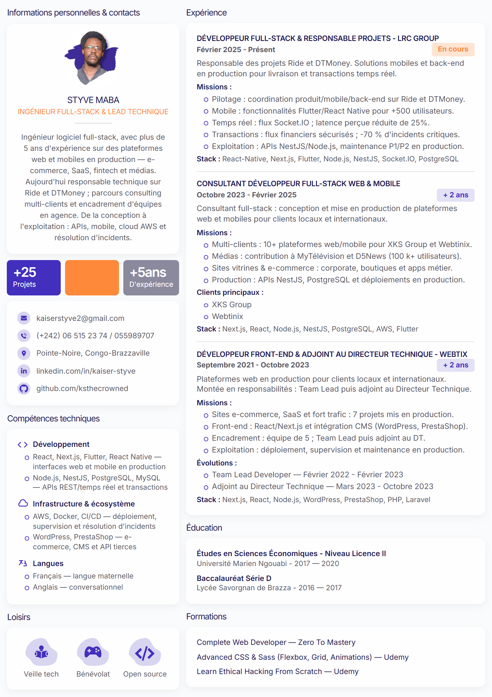

# CV Kaiser Styve — HTML/CSS

Version éditable du CV, reproduite depuis le [design Figma](https://www.figma.com/design/a5r0BmmM6idmFAgBAae6dw/Kaiser-Styve---CV?node-id=4-4&m=dev).

Le projet est statique (HTML/CSS/JS) et piloté par JSON:
- contenu multilingue par variante (`data/variants/*.json`)
- libellés d'interface (`data/i18n/*.json`)
- rendu dynamique (`js/render.js`)

## Aperçu du rendu



## Prévisualisation

```bash
npx serve .
```

Ouvrir [http://localhost:3000](http://localhost:3000)

> Le fichier JSON ne se charge pas en `file://` à cause des restrictions CORS du navigateur. Utilisez toujours un serveur local.

Alternative (si Bun est installé):

```bash
bun run preview
```

## Édition

| Modifier | Fichier |
|----------|---------|
| Contenu CV (toutes langues) | `data/variants/*.json` → `locales.fr`, `locales.en`, … |
| Libellés UI (titres de section, « Missions », etc.) | `data/i18n/fr.json`, `data/i18n/en.json` |
| Variante par défaut | `data/variants/default.json` |
| Index des variantes | `data/variants/manifest.json` |
| Structure HTML (coquille vide) | `index.html` |
| Couleurs, polices, espacements | `css/tokens.css` |
| Mise en page | `css/layout.css` |
| Impression PDF | `css/print.css` |

### Langues et variantes (depuis l'URL)

```bash
bun run preview
# Français (défaut) → http://localhost:3000/?variant=default&lang=fr
# Anglais          → http://localhost:3000/?variant=default&lang=en
# Variante + langue custom → http://localhost:3000/?variant=<slug>&lang=<code>
```

Chaque variante peut définir `meta.defaultLocale` et `meta.availableLocales`. Le contenu traduit vit dans `locales.<code>`; les libellés d’interface partagés dans `data/i18n/<code>.json`.

## Barre d'outils de preview

En haut de la page:
- `Rognage A4 : activé/désactivé` pour simuler l'export 1 page
- sélecteur `Poste` (variante)
- sélecteur `Langue`

Le rognage est mémorisé en local (`localStorage`).

### Variantes par offre d'emploi

Chaque variante est un fichier JSON dans `data/variants/` :

```bash
bun run preview
# CV par défaut → http://localhost:3000/?variant=default
# Autre variante → http://localhost:3000/?variant=<slug>
```

Pour générer une nouvelle variante alignée sur une JD, invoquer le skill **`cv-variant-builder`** (`.cursor/skills/cv-variant-builder/`).

Pour un usage hors Cursor, dupliquez simplement `data/variants/default.json` vers `data/variants/<slug>.json`, puis ajoutez l'entrée correspondante dans `data/variants/manifest.json`.

### Exemple — ajouter une mission

Dans `data/variants/default.json` (ou la variante cible), ajoutez une ligne dans le tableau `missions` de l'expérience concernée, au format `Thème : description`.

## Export PDF (A4)

1. Ouvrir le CV via `npx serve .` ou `bun run preview`
2. **Ctrl+P** (ou Cmd+P sur Mac)
3. Destination : **Enregistrer en PDF**
4. Marges : **Aucune**
5. Échelle : **100 %**
6. Cocher **Graphiques d'arrière-plan**

## Structure

```
index.html                  → coquille HTML (conteneurs vides)
data/i18n/fr.json           → libellés UI français
data/i18n/en.json           → libellés UI anglais
data/variants/default.json  → contenu par locale (fr, en, …)
data/variants/<slug>.json   → variantes par offre
data/variants/manifest.json → index des variantes
css/tokens.css              → variables design (couleurs Figma)
css/layout.css              → mise en page
css/print.css               → règles impression A4
js/render.js                → injection (?variant= & ?lang=)
```

## Photo

Exportez votre photo depuis Figma (node `4:635`) et placez-la dans `assets/photo.png` (ou adaptez `index.html` si vous changez l'extension).

## Couleurs (Figma frame 4:4)

| Token | Valeur | Surbrillance | Usage |
|-------|--------|--------------|-------|
| `--color-primary` | `#1e1950` | <span style="display:inline-block;width:14px;height:14px;border-radius:3px;background:#1e1950;border:1px solid #ddd;vertical-align:middle;"></span> | Titres, nom |
| `--color-accent` | `#422fbd` | <span style="display:inline-block;width:14px;height:14px;border-radius:3px;background:#422fbd;border:1px solid #ddd;vertical-align:middle;"></span> | Sections, icônes |
| `--color-orange` | `#ff893a` | <span style="display:inline-block;width:14px;height:14px;border-radius:3px;background:#ff893a;border:1px solid #ddd;vertical-align:middle;"></span> | Titre sous le nom |
| `--color-text` | `#585665` | <span style="display:inline-block;width:14px;height:14px;border-radius:3px;background:#585665;border:1px solid #ddd;vertical-align:middle;"></span> | Corps de texte |
| `--font-family` | Inter | — | Police Figma |
