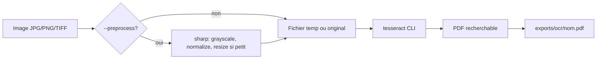

# OCR Image → PDF recherchable — Design Spec

**Date:** 2026-06-18  
**Statut:** Approuvé  
**Cas pilote:** `C:/Users/pc/Downloads/1689110881840.jpg` (certificat ZTM)

## Objectif

Ajouter un pipeline **image/scan → PDF recherchable** (image originale conservée + couche texte invisible) dans le dépôt `personal-resume`, réutilisable pour certificats, scans de documents, etc.

## Contraintes validées

| Contrainte | Décision |
|------------|----------|
| Type de PDF | **Recherchable** — image + couche texte invisible (Ctrl+F, copier-coller) |
| Périmètre | Script CLI réutilisable + skill Cursor |
| Moteur OCR | **Tesseract local uniquement** — pas de fallback cloud |
| Approche technique | **Tesseract CLI** (`tesseract input.jpg output pdf`) |
| Stack | Node/Bun ESM, aligné sur `scripts/*.mjs` existants |
| Premier fichier test | Certificat ZTM 800×601, texte anglais sans-serif + nom en script |

## Hors scope

- Services cloud OCR (Google Vision, Azure, OpenAI Vision)
- PDF reflow (texte reconstitué sans image d’origine)
- Reconnaissance fiable des polices script/manuscrites
- Installation automatique de Tesseract sur Windows
- Intégration dans le flux CV HTML (`export-pdfs.mjs`)

## Architecture

```
scripts/
├── ocr-to-pdf.mjs          # Point d’entrée CLI
└── lib/
    └── ocr-to-pdf.mjs      # Logique : validation, preprocess, spawn Tesseract

.cursor/skills/ocr-to-pdf/
└── SKILL.md                # Workflow agent Cursor

exports/ocr/                # Sortie par défaut (gitignored si sensible)
```

### Composants

| Unité | Responsabilité | Interface |
|-------|----------------|-----------|
| `scripts/ocr-to-pdf.mjs` | Parse args, affiche aide, appelle lib | CLI : `bun run ocr:pdf -- <input> [options]` |
| `scripts/lib/ocr-to-pdf.mjs` | Pipeline OCR complet | `ocrImageToPdf({ inputPath, outPath, lang, preprocess })` |
| `.cursor/skills/ocr-to-pdf/SKILL.md` | Guide l’agent : prérequis, commandes, dépannage | Skill Cursor |
| `sharp` (devDependency) | Prétraitement image optionnel | `--preprocess` |

## Flux de données



### Étapes détaillées

1. **Validation entrée** — fichier existe, extension supportée (`.jpg`, `.jpeg`, `.png`, `.tif`, `.tiff`, `.webp`)
2. **Résolution sortie** — par défaut `exports/ocr/<basename>.pdf` ; création du dossier si absent
3. **Prétraitement optionnel** (`--preprocess`) :
   - Conversion niveaux de gris
   - Normalisation contraste (`sharp.normalize()`)
   - Upscale si largeur &lt; 1500 px (améliore OCR sur petits scans)
   - Écriture dans un fichier temporaire
4. **OCR Tesseract** :
   ```bash
   tesseract <input> <output_base> -l <lang> pdf
   ```
   - Langue par défaut : `eng`
   - Option `--lang fra` ou `--lang fra+eng` pour documents bilingues
5. **Nettoyage** — suppression du fichier temporaire preprocess
6. **Log succès** — chemin absolu du PDF + rappel de vérifier Ctrl+F

## Interface CLI

```bash
# Usage minimal
bun run ocr:pdf -- "C:/Users/pc/Downloads/1689110881840.jpg"

# Options
bun run ocr:pdf -- <input> [--out <path>] [--lang eng] [--preprocess]

# Exemples
bun run ocr:pdf -- scan.png --lang fra+eng --preprocess
bun run ocr:pdf -- cert.jpg --out ./exports/ocr/ztm-cert.pdf
```

| Option | Défaut | Description |
|--------|--------|-------------|
| `--out` | `exports/ocr/<basename>.pdf` | Chemin de sortie |
| `--lang` | `eng` | Langues Tesseract (`eng`, `fra`, `fra+eng`) |
| `--preprocess` | off | Amélioration contraste / upscale via sharp |
| `--help` | — | Aide |

**Script npm :** `"ocr:pdf": "node scripts/ocr-to-pdf.mjs"`

## Prérequis système (Windows)

Documentés dans le skill et le README — **non installés par le projet** :

1. [Tesseract OCR for Windows](https://github.com/UB-Mannheim/tesseract/wiki) (UB Mannheim)
2. Pack de langue `eng` (inclus dans l’installateur standard)
3. Pack `fra` optionnel pour scans français
4. Binaire `tesseract` dans le PATH — vérification : `tesseract --version`

## Skill Cursor (`ocr-to-pdf`)

**Déclencheurs :** utilisateur demande conversion scan/photo → PDF texte, OCR d’une image, PDF recherchable depuis JPG.

**Workflow agent :**

1. Vérifier que Tesseract est installé (`tesseract --version`)
2. Confirmer le chemin du fichier source
3. Choisir `--lang` selon la langue du document
4. Lancer `bun run ocr:pdf -- <path> [--preprocess]`
5. Indiquer le chemin du PDF produit
6. Suggérer ouverture + test Ctrl+F sur mots-clés attendus (ex. « CERTIFICATE », « ZTM »)
7. Si OCR médiocre → relancer avec `--preprocess` ; si nom script illisible → l’expliquer comme limitation connue

## Gestion d’erreurs

| Erreur | Comportement |
|--------|--------------|
| Fichier introuvable | Exit 1, message clair avec chemin |
| Extension non supportée | Exit 1, liste des extensions acceptées |
| `tesseract` absent du PATH | Exit 1, lien install Windows + commande test |
| Langue non installée | Exit 1, message « install language pack » |
| Échec Tesseract (code ≠ 0) | Exit 1, stderr affiché |
| Dossier sortie non writable | Exit 1 |

Pas de retry automatique — l’utilisateur relance avec `--preprocess` si besoin.

## Tests & validation

### Cas pilote (acceptation)

Fichier : `1689110881840.jpg`

Critères :
- [x] PDF généré dans `exports/ocr/1689110881840.pdf`
- [x] Visuellement identique au JPG (certificat ZTM complet)
- [x] Ctrl+F trouve « CERTIFICATE », « Complete Web Developer », « JUL 11, 2023 », « CERT_QPZMH404 »
- [x] Nom script « Martin Trembac » : reconnaissance partielle ou absente acceptée

### Tests manuels additionnels

- Image inexistante → erreur propre
- `tesseract` absent → message d’installation
- `--lang fra` sur document anglais → dégradation acceptable, pas de crash

Pas de tests automatisés en v1 — dépendance binaire externe difficile à mocker sans CI dédiée.

## Modifications fichiers

| Fichier | Action |
|---------|--------|
| `scripts/ocr-to-pdf.mjs` | Créer |
| `scripts/lib/ocr-to-pdf.mjs` | Créer |
| `.cursor/skills/ocr-to-pdf/SKILL.md` | Créer |
| `package.json` | Ajouter script `ocr:pdf`, devDep `sharp` |
| `README.md` | Section « OCR — scan vers PDF recherchable » |
| `.gitignore` | Ajouter `exports/ocr/` si documents sensibles |

## Limitations connues

- Texte en **police script/cursive** (nom sur certificat) souvent mal OCRisé
- Fond à motifs légers peut ajouter du bruit OCR
- Pas de deskew automatique en v1 (ajout possible via `--preprocess` + rotation sharp si demandé plus tard)
- OCRmyPDF non retenu en v1 pour éviter dépendances Python/Ghostscript

## Évolutions futures (non planifiées)

- `--deskew` via sharp/detecteur d’angle
- Support batch (dossier entier)
- Métadonnées PDF (titre, auteur) via pdf-lib post-traitement
